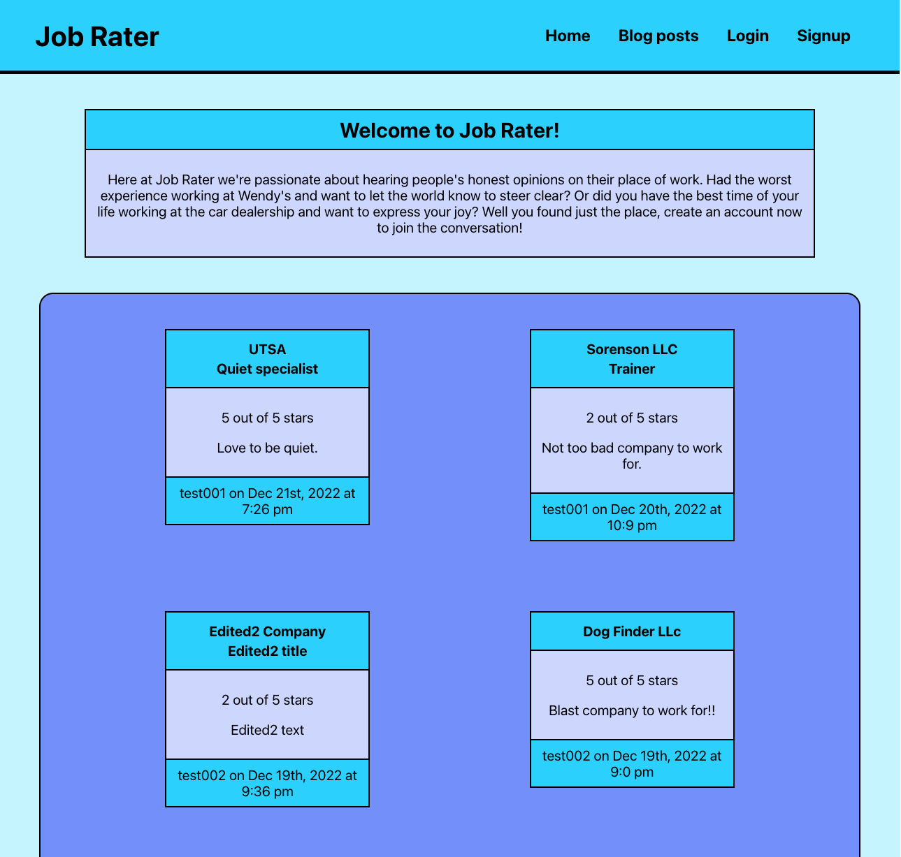

# job-rater

## Description

A site for posting reviews of previous work positions and creating employment related blog posts including work culture and the state of the work economy.

## Table of Contents

- [Description](#Description)
- [Installation](#Installation)
- [User Story](#user-story)
- [Acceptance Criteria](#acceptance-criteria)
- [Usage](#Usage)
- [Contributing](#Contributing)
- [Questions](#Questions)
- [License](#License)

## Installation

1. Install `node.js`
2. Run `npm install` to install dependencies.
3. `cd client` and then run `npm run build`
4. Run `npm start` to start the web server and connect

## User Story

```md
AS AN employee leaving my place of employment
I WANT to leave a review of the place I worked
SO THAT others are aware of what the work culture is like
```

## Acceptance Criteria

```md
GIVEN a Job Rater
WHEN I load the job rater
THEN I am presented with a menu with the options Home, Blogs posts, Login, and Signup includes whole page of users posted reviews
WHEN I click on the Blog posts menu option
THEN I am presented with the blogs of users posted with title, body of text, timestamp and username that posted the blog.
WHEN I click on the Login menu option
THEN I am presented with the login form of two inputs for an email address and password with Login button
WHEN I click on the Signup menu option
THEN I am presented with three inputs for an username, an email address, and a password includes sign up button
WHEN I enter a valid email address, username, and password to sign up
THEN my user account is created and I am logged in to the site
WHEN I am logged in to the site
THEN the menu options change to Your profile and Logout.
WHEN I click on Your profile menu option
THEN I am presented with reviews and blogs that I posted and with the option to post a new review or create a new blog
WHEN I click on Click here to post a review
THEN I am presented with form of four inputs for name of company, role in company, rating, and body of review to type.
WHEN I click Post your review button
THEN I am redirect to home page with list of all reviews
WHEN I click make your own blog post
THEN I am presented with form of 2 inputs for blog title and blog body of text with post blog button
When I enter my blog title and body and click make your blog
THEN I am redirect to home page with list of all reviews
WHEN I click edit on my blog or review
THEN I am presented with form that has my previous value with option update or delete button
WHEN I make a change on one of those value and click update button
THEN I am presented to home page with my updated change
WHEN I click on the Logout button
Then I am logged out of the site and presented with a menu with the options Home, Blogs posts, Login, and Signup includes whole page of users posted reviews.
```

## Usage

The Job Rater application is currently deployed with [Heroku](https://blooming-stream-37548.herokuapp.com/)

- Screenshot of Job Rater's homepage
  

## Contributing

1. Fork this repository
2. Create a new branch
3. Commit changes on your branch
4. Push your changes
5. Create a new pull request

## Questions

If you have any question or would like to report the issues in this project, please feel free to contact me at bsolis6878@gmail.com

## License

This project is license under the [MIT](./LICENSE)

&copy; 2022 Bryan Solis & Joseph Lara
